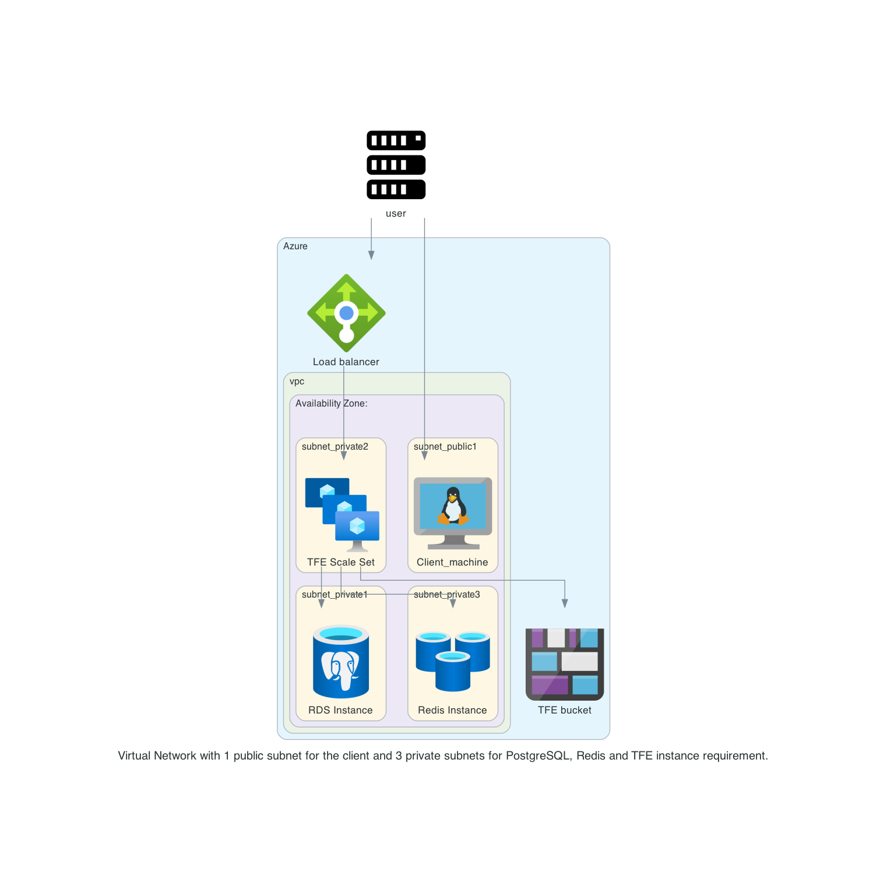

# Terraform Enterprise FDO - Active-Active on Azure

This is a repository to have a TFE FDO active-active environment on Azure. This is using a PostgreSQL, Redis and bucket from Azure. 


# Diagram

  

# Prerequisites

## License
Make sure you have a TFE license available for use

## Azure

Have your Azure credentials configured

## AWS

This repository uses AWS resources for the DNS resources and creating the records

## Install terraform  
See the following documentation [How to install Terraform](https://learn.hashicorp.com/tutorials/terraform/install-cli)

## TLS certificate
You need to have valid TLS certificates that can be used with the DNS name you will be using to contact the TFE instance.  
  
The repo assumes you have no certificates and want to create them using Let's Encrypt and that your DNS domain is managed under AWS. 

# How to

- Clone the repository to your local machine
```sh
git clone https://github.com/munnep/tfe_azure_active_mode_fdo.git
```
- Go to the directory  
```sh
cd tfe_azure_active_mode_fdo
```
- create a file called `variables.auto.tfvars` with the following contents and your own values
The example file `variables.auto.tfvars_example` can be used for reference.
```
# General
tag_prefix        = "tfe21"                        # TAG prefix for names to easily find your AWS resources
dns_hostname      = "tfe21"                        # DNS hostname for the TFE
dns_zonename      = "aws.munnep.com"               # DNS zone name to be used
tfe_release       = "v202502-1"                    # Version number for the release to install. This must have a value
tfe_password      = "Password#1"                   # TFE password for the dashboard and encryption of the data
certificate_email = "patrick.munne@hashicorp.com"  # Your email address used by TLS certificate 
tfe_license       = "xxxxxxxxxxxxxx"               # license file being used
# AWS
region            = "eu-north-1"                   # AWS region creating the DNS records
# Azure   
subscription_id      = "7bee60d1-03fa-4b64-"       # subscription id used by Azure provider
vnet_cidr            = "10.214.0.0/16"             # Network to be used
postgres_user        = "tfe"                       # PostgreSQL admin user to be created and used by TFE
postgres_password    = "Password#1"                # PostgreSQL admin password to be used
storage_account      = "tfe21patrick"              # Name of the storage account to be created unique in the world
number_tfe_instances = 1                           # Number of TFE instances in the VM Scale Set - First start with 1
public_key           = "ssh-rsa AAAAB3Nza"         # public key used to connect to the VM instance

```
- Terraform initialize
```
terraform init
```
- Terraform plan
```
terraform plan
```
- Terraform apply
```
terraform apply
```
- Terraform output should create 39 resources and show you the public dns string you can use to connect to the TFE instance
```
Apply complete! Resources: 39 added, 0 changed, 0 destroyed.

Outputs:

ssh_client_public_ip = "ssh adminuser@20.123.77.5"
ssh_tfe_nodes = [
  "node-0: ssh -J adminuser@20.123.77.5 adminuser@10.214.2.4"
]
tfe_appplication = "https://tfe21.aws.munnep.com"
```
- You can now login to the application with the admin username and password specified in your variables.
- If you want to have more instances change the value
```
number_tfe_instances = 2                           # Number of TFE instances in the VM Scale Set 
```
- Terraform apply
```
terraform apply
```
- output will show 2 instances now
```
ssh_client_public_ip = "ssh adminuser@20.123.77.5"
ssh_tfe_nodes = [
  "node-0: ssh -J adminuser@20.123.77.5 adminuser@10.214.2.4",
  "node-1: ssh -J adminuser@20.123.77.5 adminuser@10.214.2.6",
]
tfe_appplication = "https://tfe21.aws.munnep.com"
```
# TODO

# DONE
- [x] build network according to the diagram
- [x] use standard ubuntu 
- [x] Create an RDS PostgreSQL
- [x] Create a Redis
- [x] create an elastic IP to attach to the instance
- [x] Create a Loadbalancer with a public IP address
- [x] create a virtual machine Scaling set
    - [x] firewall inbound are all from user building external ip
    - [x] firewall outbound rules
    - [x] postgresql rds
    - [x] bucket
    - [x] user building external ip
- [x] Create a valid certificate to use 
- [x] point dns name to public ip address
- [x] install TFE with a script on the Virtual Machine Scaling set 


